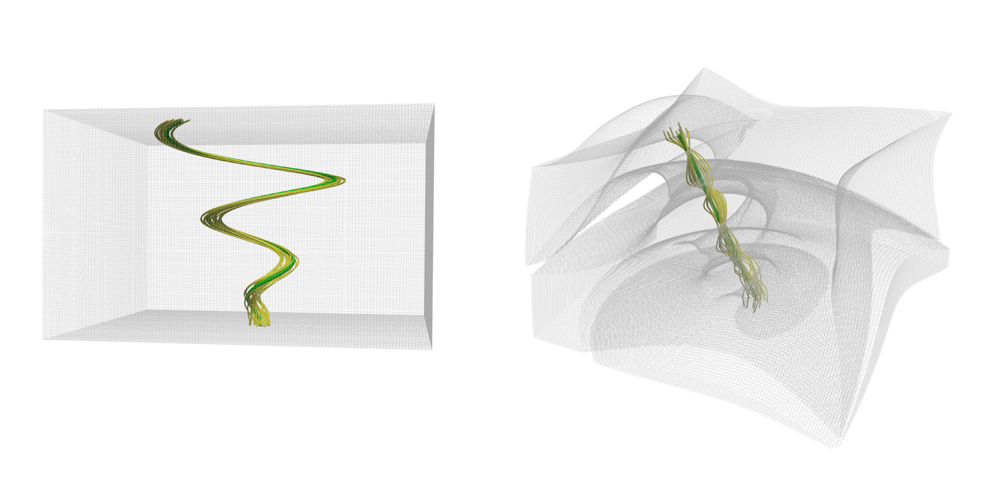

# Feature-Based Deformation for Flow Visualization

Straightening a so-called feature line, the surrounding space is deformed.

*Authors:*  
Alexander Straub, Filip Sadlo, and Thomas Ertl.

*Abstract:*  
In this paper, we present an approach that helps investigation and understanding of flow dynamics in the neighborhood of curved line-type features, such as vortex core lines and attachment lines. We employ continuous deformations to the flow fields to straighten such features. This provides "deformed frames of reference", within which the underlying flow dynamics are better observable and interpretable. Our approach operates at interactive rates on graphics hardware, and supports exploration of large and complex datasets by navigating the additional degree of freedom of deformation. We demonstrate the properties and the utility of our approach using synthetic and simulated flow fields.

## Input

| Input                     | Description                                                                           | Type          | Remark                    |
|---------------------------|---------------------------------------------------------------------------------------|---------------|---------------------------|
| Feature                   | Feature line that is straightened and used as reference for the space deformation.    | Poly data     |                           |
| Grid                      | The underlying grid that is deformed.                                                 | Regular grid  | optional                  |
| Geometry                  | Additional geometry that is deformed.                                                 | Point set     | optional, multiple inputs |

## Output

| Input                     | Description                                                                           | Type                              | Remark                            |
|---------------------------|---------------------------------------------------------------------------------------|-----------------------------------|-----------------------------------|
| Deformed Features         | Straightened feature line and correspondingly deformed lines.                         | Poly data                         |                                   |
| Deformed Geometry         | Deformed geometry, only translating the points, leaving the cells as they are.        | Multiblock dataset                | Block for every input             |
| Deformed Grid             | Deformed grid.                                                                        | Structured or unstructured grid   | Depends on cell removal option    |
| Resampled Grid            | Grid with resampled deformed velocities.                                              | Regular grid                      |                                   |

## Parameters

| Parameter                 | Description                                                                                       | Default value |
|---------------------------|---------------------------------------------------------------------------------------------------|---------------|
| Line ID                   | ID of the feature line that is straightened. All other provided lines are deformed accordingly.   | 0             |
| Vectors                   | Input velocity field that is adjusted for the deformed grid.                                      |               |

**Smoothing:**

| Parameter                 | Description                                                                                       | Default value         |
|---------------------------|---------------------------------------------------------------------------------------------------|-----------------------|
| Method                    | Method for straightening the feature line (see list below).                                       | Iterative smoothing   |
| Variant                   | Variant for treating the endpoints of the feature line (see list below).                          | Growing               |
| Number of iterations      | Number of smoothing iterations.                                                                   | 1000                  |
| Smoothing factor          | Smoothing factor between 0 (no smoothing) and 1 (strong smoothing).                               | 0.7                   |

There are three different methods implemented:
- *Direct displacement:* perform a single deformation step to reach the fully straightened line
- *Iterative smoothing:* can be used to animate the evolution of the deformation
- *Time-local:* restrict the deformation to the form (dx, dy, 0), assuming time on the z dimension

Additionally, the endpoints are treated accoring to these two variants:
- *Fixed endpoints*: The location of the endpoints is fixed
- *Growing*: The endpoints are allowed to move freely as long as their distance increases. Afterwards their location is fixed for the remaining smoothing steps.

**Animation:**

| Parameter                 | Description                                                                           | Default value |
|---------------------------|---------------------------------------------------------------------------------------|---------------|
| Interpolator              | Mapping of real time onto the smoothing iteration step.                               | Exponential   |
| Duration                  | Duration of the animation (in seconds) when triggered using the python script.        | 5             |
| Inverse                   | Invert animation playback.                                                            | no            |

**Deformation:**

| Parameter                             | Description                                                                                   | Default value     |
|---------------------------------------|-----------------------------------------------------------------------------------------------|-------------------|
| Weight                                | Method used for deforming the space around the feature line (see list below).                 | B-Spline Joints   |
| Inverse distance weighting exponent   | Exponent for the inverse distance weighting.                                                  | 5                 |
| Voronoi distance                      | Number of neighbors to closest feature line point included for inverse distance weighting.    | 1                 |
| B-Spline degree                       | Degree of the B-spline.                                                                       | 3                 |
| Gauss kernel parameter                | Parameter for the Gauss function, defining the region of influence.                           | 0.1               |
| Number of subdivisions                | Number of iterations for binary search of the closest point on the B-spline.                  | 10                |

There are six different deformation methods implemented:
- *Greedy:* Translations are defined at the feature line points, inverse distance weighting is used as interpolation method.
- *Greedy Joints:* Translations and rotations are defined at the feature line points, inverse distance weighting is used as interpolation method.
- *Voronoi:* The closest line point of the feature line is determined and only its neighbors used for interpolation using inverse distance weighting.
- *Projection:* The closest point on the feature line is determined and its position used for linear interpolation between the two adjacent line points.
- *B-Spline:* The closest point on the B-spline is determined and the translation defined as displacement between the original and the deformed B-spline.
- *B-Spline Joints:* The closest point on the B-spline is determined, and the translation and rotation defined as transformation of the original onto the deformed B-spline.

**Pre-computation:**

| Parameter                             | Description                                                                                                           | Default value     |
|---------------------------------------|-----------------------------------------------------------------------------------------------------------------------|-------------------|
| Compute Gauss parameter epsilon       | Compute Gauss parameter instead of setting it manually, where the largest possible Gauss parameter should be found.   | no                |
| Check handedness                      | Only right-handed cells are allowed, preventing self-penetration of cells.                                            | yes               |
| Check convexity                       | Only convex cells are allowed.                                                                                        | yes               |
| Check volume                          | Check area (in 2D) or volume (in 3D) of the cells and require them to be sufficiently large.                          | no                |
| Volume percentage                     | Minimum area (in 2D) or volume (in 3D) necessary, compared to the original cell size.                                 | 0.2               |
| Number of subdivisions                | Number of iterations of binary search to find an adequate Gauss parameter.                                            | 10                |
| Identify tearing regions              | Pre-compute tearing regions, by marking points of removed cells in the last time step.                                | no                |

**Output:**

| Parameter                         | Description                                                                           | Default value |
|-----------------------------------|---------------------------------------------------------------------------------------|---------------|
| Output B-Spline distance          | Compute and output distance of neighboring points mapped onto the B-spline.           | no            |
| Output deformed grid              | Output the deformed grid.                                                             | no            |
| Output vector field               | Output adjusted vector field as attribute of the deformed grid.                       | no            |
| Output resampled grid             | Resample deformed velocities on the original grid.                                    | no            |
| Remove elongated cells            | Remove cells that are too large and therefore unreliable for computations.            | no            |
| Scalar determining cell removal   | Factor determining the threshold for cell removal.                                    | 2.0           |

## Example

Example for a generated, synthetic Spiral Vortex dataset. The vortex core line (dark green) and the close streamlines (light green) are shown for the original (left), and for the deformed (right) space. The deformed grid was partly torn apart due to strong deformation.

## Usage

The project uses CMake as build system. To configure the project run CMake. Note that CUDA is required.

# License

This project is published under the MIT license. In the following you can find a list of contributors.

## List of contributors

- Alexander Straub, University of Stuttgart, Germany  
  (alexander.straub@visus.uni-stuttgart.de)

## MIT license

Copyright (c) 2020 University of Stuttgart Visualization Research Center

Permission is hereby granted, free of charge, to any person obtaining a copy
of this software and associated documentation files (the "Software"), to deal
in the Software without restriction, including without limitation the rights
to use, copy, modify, merge, publish, distribute, sublicense, and/or sell
copies of the Software, and to permit persons to whom the Software is
furnished to do so, subject to the following conditions:

The above copyright notice and this permission notice shall be included in all
copies or substantial portions of the Software.

THE SOFTWARE IS PROVIDED "AS IS", WITHOUT WARRANTY OF ANY KIND, EXPRESS OR
IMPLIED, INCLUDING BUT NOT LIMITED TO THE WARRANTIES OF MERCHANTABILITY,
FITNESS FOR A PARTICULAR PURPOSE AND NONINFRINGEMENT. IN NO EVENT SHALL THE
AUTHORS OR COPYRIGHT HOLDERS BE LIABLE FOR ANY CLAIM, DAMAGES OR OTHER
LIABILITY, WHETHER IN AN ACTION OF CONTRACT, TORT OR OTHERWISE, ARISING FROM,
OUT OF OR IN CONNECTION WITH THE SOFTWARE OR THE USE OR OTHER DEALINGS IN THE
SOFTWARE.
